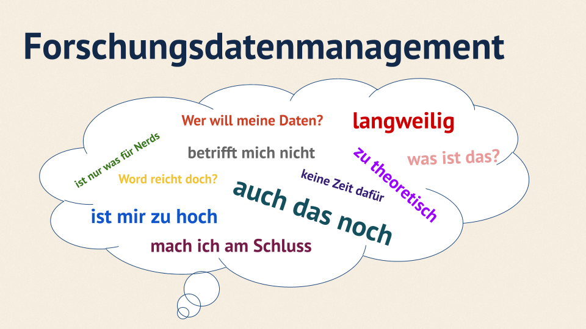

## Oh je...

{fig-alt="Ängste vor FDM."}


## ⏱️ Ablauf {.smaller}

| Zeit | Phase | Inhalt | Format |
|---|---|---|---|
| 14:00–14:05 | **Einstieg** | Vorstellung, Lernziele, Blitzumfrage: „Wer hat schon einmal Grabungsdaten archiviert?" | Plenum |
| 14:05-14:15 | **FAIR-Prinzipien** | Welche Bedeutung haben die FAIR-Prinzipien im FDM | Plenum |
| 14:15–14:30 | **F – Theorie** | **Findable**: PID (DOI), Repositorien, Metadatenstandards (CIDOC CRM, Dublin Core) | Vortrag + Folie |
| 14:30–14:45 | **F – Übung 1** | Metadaten-Check: 3 Funddatensätze bewerten | Partnerarbeit |
| 14:45-15:00 | Pause |||
| 15:00-15:15 | **A – Theorie** | **Accessible**: offene vs. sensible Daten, Lizenzen (CC BY 4.0), Embargo, Zugriffsprotokolle | Vortrag + Folie |
| 15:15–15:30 | **A – Übung 2** | Lizenz-Wahl für 5 Datenszenarien | Einzelarbeit + Diskussion |
| 15:30-15:45 | **I – Theorie** | **Interoperable**: offene Formate (CSV, GeoJSON, IFC, E57), Vokabulare | Vortrag + Folie |
| 15:45-16:00 | **R – Theorie** | **Reusable**: Dokumentation, Provenienz, Data Management Plan | Vortrag + Folie |
| 16:00–16:15 | **I+R – Übung 3** | Mini-DMP für eine 4-Wochen-Surveykampagne erstellen | Kleingruppen (3 Pers.) |
| 16:15-16:45 | **Abschluss** | Reflexionsrunde, Ressourcenliste | Plenum |

: Ablauf {#tbl-beispiel tbl-colwidths="[10,10,60,20]"}

## 🎯 Lernziele

Nach dem Workshop können die Teilnehmenden:

- die FAIR-Prinzipien auf archäologische Datentypen (Befunde, Funde, 3D-Modelle, Geodaten) anwenden
- einen kleinen Datenmanagement-Plan (DMP) für ein Grabungsprojekt skizzieren
- Persistente Identifikatoren (DOI) und Repositorien unterscheiden
- typische Fallstricke benennen (inkonsistente Terminologie, proprietäre Formate, fehlende Metadaten)

## 📚 Theorieteile

### Was ist euer Verständnis von Forschungsdatenmanagement?

## Der Forschungsdatenlebenszyklus

](img/ResearchCycle.jpg){fig-alt="TouringWay-Forschungsdatenlebenszyklus"}


## Die FAIR-Prinzipien

](img/FAIR-Prinzipien.png){fig-alt="TouringWay-FAIR-Prinzipien"}

## Die FAIR-Prinzipien

Die FAIR-Prinzipien wurden von der FORCE11-Community geprägt und 2016 das erste Mal beschrieben. In den letzten Jahren sind sie ein **essenzieller Standard im Forschungsdatenmanagement** geworden.

FAIR steht für **F**indable (auffindbar), **A**ccessible (zugänglich), **I**nteroperable (kompatibel) und **R**eusable (nachnutzbar). Die Prinzipien sollen Orientierung für den **Umgang mit Forschungsdaten** bei der Dokumentation, Veröffentlichung und Archivierung bieten. Ziel ist es, **Forschungsdaten für Menschen und Maschinen optimal aufzubereiten** und zugänglich zu machen, sodass die Wiederverwendbarkeit von Datenbeständen verbessert wird.

Das Akronym FAIR ist inzwischen fester Bestandteil des Fachjargons von Forschungsdatenmanager:innen und wird auch als Adjektiv, wie in „FAIRe Daten“ oder in Wortschöpfungen wie „FAIRification“ verwendet. Auch in Policys und Vorgaben unterschiedlichster Player wird der Begriff immer häufiger verwendet, z. B. seit 2017 in den Förderrichtlinien der EU.

## F – Findable (auffindbar)

* **Warum ist das wichtig?** 
    * Archäologische Daten sind oft verstreut in Grabungsberichten, Excel-Tabellen, Feldtagebüchern.  
* **PIDs** (Persistent Identifiers): **DOI** (z. B. über Zenodo).  
* **Repositorien für Archäologie**  
* **Metadatenstandards:** **CIDOC CRM** (domänenspezifisch), **Dublin Core** (generisch).

## PID und Repositorien an der Goethe Universität

--> Inhalte von FDM-Managerin der GU

## ✏️ Übung 1 - Datenorganisation in der Praxis (20 Minuten) {background-color=''}

**Aufgabe (Gruppenarbeit à 3–4 TN):**

> *Sie haben den Datensatz einer fiktiven Ausgrabung übernommen: 200 Fotos (RAW \+ JPG), 30 Befundbeschreibungen (Word/PDF), eine Fundliste (Excel, 800 Einträge), GPS-Tracks (GPX), 5 Grabungspläne (DWG/PDF), ein C14-Probenformular, ein vorläufiger Grabungsbericht. Entwerfen Sie eine nachvollziehbare Ordnerstruktur, ein konsistentes Benennungsschema und eine README-Datei.*

<!-- Contact Folio verteilen mit wischbaren Stiften -->

## A – Accessible (zugänglich)

* **Offene vs. sensible Daten**:  
  * offen: Befundbeschreibungen, publizierte Funde  
  * sensibel: Koordinaten unpublizierter Fundstellen (Denkmalschutz\!), personenbezogene Daten (Gräber)  
* **Lizenzen:** Standard **CC BY 4.0**; bei Daten mit Klärungsbedarf **CC BY-SA** oder **CC0** für rein faktische Daten.  
* **Zugriff:** offener Download, dokumentierte API, klarer Embargo-Zeitraum.

## Theorieteil zu Lizenzen (Kai)

XXX

## ✏️ Übung 2 - Lizenzierung in der Praxis (20 Minuten) {background-color=''}

**5 Szenarien** – welche Lizenz passt?

1. Hochauflösender 3D-Scan einer öffentlich zugänglichen Tempelruine  
2. Koordinaten einer neu entdeckten, unpublizierten Siedlung  
3. Fotos von Bestattungen mit erkennbaren Personen  
4. Typologische Daten einer bereits publizierten Keramikserie  
5. Stratigrafische Zeichnungen aus einem abgeschlossenen DFG-Projekt

**Lösungs-Spektrum:** CC0 / CC BY 4.0 / CC BY-SA 4.0 / Embargo / nicht offen.

## I – Interoperable (interoperabel)

* **Offene Formate statt proprietärer:**  
  * Tabellen → **CSV** statt `.xlsx`  
  * Geodaten → **GeoJSON** oder **Shapefile** (mit offener Spezifikation)  
  * 3D-Scans → **E57** oder **PLY** statt herstellerspezifischer Rohformate  
  * Bauaufnahme → **IFC** (BIM)  
* **Kontrollierte Vokabulare:** **Getty AAT** (Objektarten), **Periodo** (Zeitstellung), **Thesaurus** der RGK.

## R – Reusable (nachnutzbar)

* **Provenienz & Kontext** sind in Archäologie zentral – ohne Befundkontext ist ein Fund wertlos.  
* **Dokumentation:** Feldtagebuch, Aufnahmeprotokolle, Geräteeinstellungen, Bearbeitungsschritte.  
* **DMP** (Data Management Plan) als Pflichtdokument vieler Förderer (DFG, EU/Horizon Europe).  
* Mindestangaben: Datenart, Volumen, Speicherort, Verantwortliche, Lösch-/Archivierungsfristen.

## ✏️ Übung 3 – Mini-DMP „Interoperable \+ Reusable" (20 Minuten) {background-color=''}

**Szenario:** 4-wöchige Surveykampagne in Mittelgebirgsregion, 2 Grabungsteams, GPS, Drohnen-Photogrammetrie, \~3000 Funde erwartet.

**Zu erstellende Mini-DMP-Tabelle:**

| Datenart | Format | Volumen | Speicherort | Lizenz | Verantwortlich |
|---|---|---|---|---|---|
| GPS-Tracks | GeoJSON | ~50 MB | Zenodo / DAVID | CC BY 4.0 | … |
| Drohnen-Orthofotos | GeoTIFF | ~15 GB | institutionelles Repo + Embargo | CC BY 4.0 nach Embargo | … |
| Fundlisten | CSV | ~5 MB | Zenodo | CC BY 4.0 | … |
| 3D-Modelle | E57, PLY | ~40 GB | DAVID | CC BY-NC 4.0 | … |
| Feldtagebücher | PDF/A | ~200 MB | DAVID (mit Transkription) | CC BY 4.0 | … |


---


## Steinbruch
------------ Steinbruch Erstentwurf ------------------

## Ablauf {.smaller}

| Phase | Zeit | Dauer | Inhalt | Methode |
|---|---|---|---|---|
| **1** | 0:00–0:05 | 5 min | Begrüßung, Vorstellung, Lernziele, Vorwissens-Aktivierung | Plenum |
| **2** | 0:05–0:20 | 15 min | FDM-Grundlagen, FAIR-Prinzipien, Datenlebenszyklus | Impulsvortrag + kurze Diskussion |
| **3** | 0:20–0:35 | 15 min | Archäologische Datentypen, Metadatenstandards, Dokumentationssysteme | Impulsvortrag + Beispiele |
| **4** | 0:35–0:40 | 5 min | Pause / informeller Austausch | Plenum |
| **5** | 0:40–1:00 | 20 min | **Praxis 1**: Datenorganisation, Ordnerstruktur, Benennung, ReadMe | Gruppenarbeit (3–4 TN) |
| **6** | 1:00–1:15 | 15 min | **Praxis 2**: Tools-Demo (OpenRefine / QGIS) + Metadateneingabe | Live-Demo |
| **7** | 1:15–1:25 | 10 min | Rechtliches (Denkmalschutz, DSGVO, Lizenzen), Repositorien & NFDI4Objects | Impulsvortrag |
| **8** | 1:25–1:30 | 5 min | Q&A, Ressourcen, Feedback, Ausblick auf Folgeworkshops | Plenum |

## Vorwissen

Was bedeutet für euch Forschungsdatenmanagement?

## Forschungsdatenmanagement

DEFINITION

## Die FAIR-Prinzipien

| Prinzip | Bedeutung | Beispiel Archäologie |
|---|---|---|
| **F**indable | Persistent Identifier (DOI), reichhaltige Metadaten, Registrierung in Repositorien | DOI-Vergabe über Zenodo für Befunddaten |
| **A**ccessible | Standardisierte Zugriffsprotokolle, klare Zugangsbedingungen | Offener vs. embargo-gestützter Zugang zu Grabungsdaten |
| **I**nteroperable | Offene Formate, kontrollierte Vokabulare, Standards | CIDOC CRM, MIDAS Heritage |
| **R**eusable | Klare Lizenzen, detaillierte Provenienz, domänenspezifische Standards | CC BY 4.0 + vollständige Metadaten zur Nachnutzung |

## Datenlebenszyklus in der Archäologie

* *Planung* → Antrag, Genehmigung, Datenmanagementplan (DMP) 
* *Erhebung* → Grabung, Prospektion, geophysikalische Messungen 
* *Bearbeitung* → Reinigung, Restaurierung, Inventarisierung 
* *Analyse* → GIS, Statistik, archäometrische Verfahren 
* *Interpretation* → Synthese, Modellbildung 
* *Publikation* → Vor- und Endbericht, Open Access 
* *Archivierung / Nachnutzung* → Langzeitarchiv, Repositorium

> Jede Phase erzeugt eigene Daten – durchgehende Dokumentation ist entscheidend.

##   {background-color=''}

Archäologie-spezifische Aspekte

## Datentypen im Überblick

* **Felddokumentation**: Befundbeschreibungen, Grabungsfotos, Handskizzen, Profilzeichnungen 
* **Räumliche Daten**: GPS-Tracks, GIS-Layer, Vermessungsdaten, Drohnen-Aufnahmen 
* **Geophysikalische Daten**: Magnetogramme, GPR (Ground Penetrating Radar), LIDAR-Punktwolken 
* **3D-Daten**: Photogrammetrie, Laserscans, RTI (Reflectance Transformation Imaging) 
* **Funddaten**: Inventarlisten, Maße, Materialbeschreibungen, Datierungen 
* **Proben**: C14, aDNA, Isotopen, archäometrische Analysen, Bodenproben 
* **Verwaltungsdaten**: Grabungsanträge, Genehmigungen, Verträge, Grabungsberichte

## Relevante Metadatenstandards

* **CIDOC CRM** (ISO 21127): konzeptuelles Referenzmodell für Kulturerbe-Information 
* **MIDAS Heritage**: britischer Standard für Denkmalpflege- und Inventardaten 
* **Dublin Core**: allgemeiner Standard, oft als Basis genutzt 
* **ARIADNE / ARIADNE Infrastructure**: integrierte archäologische Dateninfrastruktur 
* **tDAR-Vokabulare**: nordamerikanische Konventionen

## Spezifische Herausforderungen

* Komplexität stratigraphischer Beziehungen (Harris Matrix) 
* Sensitive Daten: Lageinformationen schützen vs. Open Data 
* Heterogenität: analoge \+ digitale Daten, oft über Jahrzehnte verteilt 
* Mehrere Bearbeiter:innen über lange Zeiträume 
* Sprachliche Vielfalt (mehrsprachige Befundbeschreibungen)

## {background-color=''}

**PAUSE**

## {background-color=''}

**DATENORGANISATION IN DER PRAXIS**

## Datenorganisation in der Praxis (20 min)

**Aufgabe (Gruppenarbeit à 3–4 TN):**

> *Sie haben den Datensatz einer fiktiven Ausgrabung übernommen: 200 Fotos (RAW \+ JPG), 30 Befundbeschreibungen (Word/PDF), eine Fundliste (Excel, 800 Einträge), GPS-Tracks (GPX), 5 Grabungspläne (DWG/PDF), ein C14-Probenformular, ein vorläufiger Grabungsbericht. Entwerfen Sie eine nachvollziehbare Ordnerstruktur, ein konsistentes Benennungsschema und eine README-Datei.*

## Datenorganisation in der Praxis (20 min)

**Leitfragen für die Gruppenarbeit:**

1. Wie strukturieren Sie Ordner? Nach Befund, Materialtyp, Projektphase oder Hybrid? 
2. Welche Dateinamens-Konvention wählen Sie? (Datum, Befund-Nr., Bearbeiter, Version) 
3. Welche Inhalte gehören in die README? (Projektkontext, Verantwortlichkeiten, Kontakt, Lizenz) 
4. Wie lösen Sie Versionierung? (Dateiversionen, Git, Archivkopien) 
5. Wie unterscheiden Sie Rohdaten von bearbeiteten Daten?

## Datenorganisation - Best Practice

XXX

## {background-color=''}

**TOOLS UND METADATEN IN DER PRAXIS**

## Tools und Metadaten in der Praxis (15 Min)

* **OpenRefine**: Bereinigung einer Fundliste 
  * Duplikate entfernen 
  * Werte vereinheitlichen (z. B. Materialangaben) 
  * Export als RDF/XML oder CSV 
* **QGIS**: Einbinden archäologischer Daten 
  * GPS-Tracks visualisieren 
  * Befund-Polygone anlegen 
  * Export als GeoPackage 
* **Markdown-README**: gemeinsames Ausfüllen einer Vorlage 
* **Repositorium-Demo**: Eingabe von Metadaten in Zenodo oder einen NFDI4Objects-Workflow

## ✏️ Praktische Übungen

---

## Übung 1 – Metadaten-Check „Findable" (15 Minuten)

**Aufgabe:** Die Teilnehmenden erhalten **3 realistische Funddatensätze** (z. B. CSV-Auszug, Screenshot einer Datenbank). Bewertet werden:

* Hat jeder Datensatz eine eindeutige ID?  
* Ist der Kontext (Projekt, Grabung, Datum) erkennbar?  
* Welche 3 Metadaten fehlen kritisch?

**Ergebnis:** Jedes Paar füllt eine Checkliste aus und benennt die **3 wichtigsten fehlenden Metadatenfelder**.

> 💡 **Variante:** Teilnehmende ergänzen die fehlenden Felder direkt in der CSV und speichern eine „bereinigte" Version.

--> Funddatensätze in "/data"

## Bewertungstabelle

| Kriterium | Datensatz A | Datensatz B | Datensatz C |
|---|---|---|---|
| Eindeutige ID vorhanden? | ☐ | ☐ | ☐ |
| Projektname erkennbar? | ☐ | ☐ | ☐ |
| Grabungskontext erkennbar? | ☐ | ☐ | ☐ |
| Funddatum dokumentiert? | ☐ | ☐ | ☐ |
| Fundlage/Schicht dokumentiert? | ☐ | ☐ | ☐ |
| Maßangaben vorhanden? | ☐ | ☐ | ☐ |
| Beschreibung aussagekräftig? | ☐ | ☐ | ☐ |
| **Top 3 fehlende Metadaten:** | ___ | ___ | ___ |

## Hinweise für die Auswertung (optional, erst nach Bearbeitung zeigen)

* **Datensatz A** ist insgesamt gut dokumentiert. Kritisch fehlt: Bearbeiter:in, Fundkoordinaten / GIS-Bezug, Konservatorischer Zustand (z. B. ob das Eisen bereits restauriert wurde).

* **Datensatz B** hat keine eindeutigen Fund-IDs (nur laufende „Posten"), kein Planquadrat/Profilangabe, kein Maß und Gewicht, keine Befundzuordnung, kein Bearbeiter, und ein undatiertes/leeres Tiefenfeld. Mindestens 5 kritisch fehlende Metadaten.

* **Datensatz C** ist kontextuell sehr gut (Befund → Haus → Datierung), aber es fehlen: Fundkoordinaten, Tiefenangabe, Proben-Nr. / Labornummer (für 14C und Dendro), Archiv-/Magazinnummer, GPS-Bezug.


### Diskussionsfrage für den Kurs: Welcher dieser drei Datensätze wäre ohne Rückfragen direkt auswertbar – und welcher müsste zwingend in die Nachbearbeitung?


## Übung 2 – Lizenz-Wahl „Accessible" (6 min · Einzelarbeit)

**5 Szenarien** – welche Lizenz passt?

1. Hochauflösender 3D-Scan einer öffentlich zugänglichen Tempelruine  
2. Koordinaten einer neu entdeckten, unpublizierten Siedlung  
3. Fotos von Bestattungen mit erkennbaren Personen  
4. Typologische Daten einer bereits publizierten Keramikserie  
5. Stratigrafische Zeichnungen aus einem abgeschlossenen DFG-Projekt

**Lösungs-Spektrum:** CC0 / CC BY 4.0 / CC BY-SA 4.0 / Embargo / nicht offen.

---

## Übung 3 – Mini-DMP „Interoperable \+ Reusable" (6 min · 3er-Gruppen)

**Szenario:** 4-wöchige Surveyskampagne in Mittelgebirgsregion, 2 Grabungsteams, GPS, Drohnen-Photogrammetrie, \~3000 Funde erwartet.

**Zu erstellende Mini-DMP-Tabelle:**

| Datenart | Format | Volumen | Speicherort | Lizenz | Verantwortlich |
|---|---|---|---|---|---|
| GPS-Tracks | GeoJSON | ~50 MB | Zenodo / DAVID | CC BY 4.0 | … |
| Drohnen-Orthofotos | GeoTIFF | ~15 GB | institutionelles Repo + Embargo | CC BY 4.0 nach Embargo | … |
| Fundlisten | CSV | ~5 MB | Zenodo | CC BY 4.0 | … |
| 3D-Modelle | E57, PLY | ~40 GB | DAVID | CC BY-NC 4.0 | … |
| Feldtagebücher | PDF/A | ~200 MB | DAVID (mit Transkription) | CC BY 4.0 | … |


## Steinbruch für OER-Präsentationen

- Hilfsfolien für die Anpassung des Design
- Sammlung erprobter Folienbausteine für eigene Präsentationen
- Beispiele kopieren, kombinieren und an den eigenen Inhalt anpassen
- Nicht benötigte Folien und Varianten entfernen
- Metadaten, Layout und Branding zentral über die vorgesehenen YAML-Dateien steuern

## Farbpalette des Templates

<div style="display:grid; grid-template-columns:repeat(3, 1fr); gap:0.35em 0.6em; font-size:0.56em;">

<div style="grid-column:1 / -1; font-weight:700; margin-top:0.1em;">
Semantische Farbrollen
</div>

<div style="background:; color:; padding:0.45em 0.6em;">
<strong>foreground</strong><br>
``
</div>

<div style="background:; color:; border:1px solid ; padding:0.45em 0.6em;">
<strong>background</strong><br>
``
</div>

<div style="background:; color:; padding:0.45em 0.6em;">
<strong>primary</strong><br>
``
</div>

<div style="background:; color:; padding:0.45em 0.6em;">
<strong>secondary</strong><br>
``
</div>

<div style="background:; color:; border:1px solid ; padding:0.45em 0.6em;">
<strong>light</strong><br>
``
</div>

<div style="background:; color:; padding:0.45em 0.6em;">
<strong>dark</strong><br>
``
</div>


<div style="grid-column:1 / -1; font-weight:700; margin-top:0.45em;">
Corporate-Design-Palette
</div>

<div style="background:; color:; padding:0.45em 0.6em;">
<strong>text-logo</strong><br>
``
</div>

<div style="background:; color:; border:1px solid ; padding:0.45em 0.6em;">
<strong>base-background</strong><br>
``
</div>

<div style="background:; color:; padding:0.45em 0.6em;">
<strong>companion</strong><br>
``
</div>

<div style="background:; color:; padding:0.45em 0.6em;">
<strong>accent-detail</strong><br>
``
</div>

<div style="background:; color:; border:1px solid ; padding:0.45em 0.6em;">
<strong>inverse-content</strong><br>
``
</div>

<div style="background:; color:; padding:0.45em 0.6em;">
<strong>extended-soft</strong><br>
``
</div>

<div style="background:; color:; padding:0.45em 0.6em;">
<strong>extended-medium</strong><br>
``
</div>

<div style="background:; color:; padding:0.45em 0.6em;">
<strong>extended-strong</strong><br>
``
</div>

<div style="background:; color:; padding:0.45em 0.6em;">
<strong>extended-dark</strong><br>
``
</div>

</div>

# Abschnittsfolien

Abschnittsfolien werden mit der Hintergrund-Graphik `backgrounds/bg_chapter.svg` gerendert.

# Typografie und Grundelemente

Bausteine für Text, Listen, Tabellen, Hervorhebungen und Callouts.

## Standardfolie

Eine typische Inhaltsfolie kombiniert einen kurzen einleitenden Absatz mit wenigen klaren Aussagen.

- Eine zentrale Aussage pro Punkt
- Möglichst kurze und gut erfassbare Formulierungen
- Ergänzende Informationen nur dort, wo sie für das Verständnis notwendig sind

Weiterführende Informationen können als [Link zu Quarto](https://quarto.org/) oder als Literaturverweis [@petersen2023] eingebunden werden.

## Abschnitt {background-color=''}

Text auf dunklem Hintergrund.

`Inline-Code`

[Beispiellink](https://quarto.org/)

`## Abschnitt {background-color=''}`

## Heller Abschnitt {background-color=''}

Text auf hellem Hintergrund.

`Inline-Code`

[Beispiellink](https://quarto.org/)


## Lange Folienüberschrift zur Prüfung von Zeilenumbruch und Abständen

Längere Überschriften sollten automatisch umbrechen, ohne dass der Abstand zum Folieninhalt verloren geht.

Der Fließtext darunter dient dazu, die verfügbare Textbreite, die Grundschrift und den vertikalen Rhythmus bei mehrzeiligen Überschriften zu beurteilen.

## Textformatierung

Mit Markdown lassen sich Hervorhebungen direkt im Text setzen:

- **fett** für besondere Gewichtung
- *kursiv* für Begriffe oder leichte Hervorhebungen
- ***fett und kursiv*** für stärkere Akzentuierung
- ~~durchgestrichen~~ für verworfene oder korrigierte Inhalte
- `inline_code()` für Befehle, Variablen oder Dateinamen
- [Links](https://quarto.org/) für weiterführende Ressourcen

> Eine Hervorhebung sollte die inhaltliche Hierarchie unterstützen und nicht mit ihr konkurrieren.

## Listen

:::: {.columns}

::: {.column width="50%"}
**Ungeordnete Liste**

- Erster Punkt
- Zweiter Punkt
  - Unterpunkt
  - Weiterer Unterpunkt
    - Dritte Ebene
- Dritter Punkt
:::

::: {.column width="50%"}
**Geordnete Liste**

1. Vorbereitung
2. Durchführung
   1. Arbeitsschritt
   2. Kontrolle
3. Ergebnis
4. Dokumentation
:::

::::

## Tabelle

| Element | Beispiel | Bedeutung | Status |
|---|---|---|---|
| Titel | Präsentation | zentrale Überschrift | erforderlich |
| Untertitel | Einführung | ergänzende Einordnung | optional |
| Autor:in | Jane Doe | verantwortliche Person | erforderlich |
| DOI | 10.0000/00000 | persistenter Identifikator | optional |

: Beispiel für eine Tabelle mit kurzen und längeren Zellinhalten.

## Hervorgehobene Information

> Eine zentrale Aussage, Definition oder Schlussfolgerung sollte sich deutlich vom übrigen Folieninhalt abheben.

Darunter kann ein kurzer erläuternder Satz stehen, der den Kontext der hervorgehobenen Aussage ergänzt.

## Hinweise und Callouts

::: {.callout-note}
Diese Fläche dient zur Prüfung eines neutralen Hinweises mit mehrzeiligem Text und automatischem Umbruch.
:::

::: {.callout-tip}
Ein Tipp hebt eine Empfehlung, einen praktischen Hinweis oder eine hilfreiche Vorgehensweise hervor.
:::

::: {.callout-warning}
Eine Warnung weist auf mögliche Probleme, Einschränkungen oder unerwünschte Folgen hin.
:::

::: {.callout-caution}
Ein Vorsichtshinweis kennzeichnet Inhalte, bei denen besondere Aufmerksamkeit oder sorgfältiges Vorgehen erforderlich ist.
:::

::: {.callout-important}
Eine wichtige Information sollte deutlich hervorgehoben sein, ohne den übrigen Folieninhalt visuell zu dominieren.
:::

## Hinweise und Callouts {background-color=''}

::: {.callout-note}
Diese Fläche dient zur Prüfung eines neutralen Hinweises mit mehrzeiligem Text und automatischem Umbruch.
:::

::: {.callout-tip}
Ein Tipp hebt eine Empfehlung, einen praktischen Hinweis oder eine hilfreiche Vorgehensweise hervor.
:::

::: {.callout-warning}
Eine Warnung weist auf mögliche Probleme, Einschränkungen oder unerwünschte Folgen hin.
:::

::: {.callout-caution}
Ein Vorsichtshinweis kennzeichnet Inhalte, bei denen besondere Aufmerksamkeit oder sorgfältiges Vorgehen erforderlich ist.
:::

::: {.callout-important}
Eine wichtige Information sollte deutlich hervorgehoben sein, ohne den übrigen Folieninhalt visuell zu dominieren.
:::

## Verschachtelte Elemente – Standard

:::: {.columns}

::: {.column width="50%"}

### Callout

Normaler Text vor einem Callout zum Vergleich

::: {.callout-note}
Ein Hinweis mit **Fettschrift**, *Kursivschrift*, `inline_code()` und einem [externen Link](https://quarto.org/).

Auch ein Dateiname wie `_brand.yml` und ein Befehl wie `quarto render` sollten innerhalb eines Callouts eindeutig erkennbar bleiben.
:::

### Blockquote

> Ein Zitat mit **Hervorhebung**, `code` und einem [Link zu Reveal.js](https://revealjs.com/).

:::


::: {.column width="50%"}

### Bildunterschrift

.](img/placeholder.png){fig-alt="Platzhaltergrafik für den Test verschachtelter Formatierungen." width="55%"}

:::
::::


## Verschachtelte Elemente – dunkler Hintergrund {background-color=''}

:::: {.columns}

::: {.column width="50%"}

### Callout

::: {.callout-note}
Ein Hinweis mit **Fettschrift**, *Kursivschrift*, `inline_code()` und einem [externen Link](https://quarto.org/).

Auch ein Dateiname wie `_brand.yml` und ein Befehl wie `quarto render` sollten innerhalb eines Callouts eindeutig erkennbar bleiben.
:::

### Blockquote

> Ein Zitat mit **Hervorhebung**, `code` und einem [Link zu Reveal.js](https://revealjs.com/).

:::


::: {.column width="50%"}

### Bildunterschrift

.](img/placeholder.png){fig-alt="Platzhaltergrafik für den Test verschachtelter Formatierungen." width="55%"}

:::
::::


## Verschachtelte Elemente – heller Hintergrund {background-color=''}

:::: {.columns}

::: {.column width="50%"}

### Callout

::: {.callout-note}
Ein Hinweis mit **Fettschrift**, *Kursivschrift*, `inline_code()` und einem [externen Link](https://quarto.org/).

Auch ein Dateiname wie `_brand.yml` und ein Befehl wie `quarto render` sollten innerhalb eines Callouts eindeutig erkennbar bleiben.
:::

### Blockquote

> Ein Zitat mit **Hervorhebung**, `code` und einem [Link zu Reveal.js](https://revealjs.com/).

:::


::: {.column width="50%"}

### Bildunterschrift

.](img/placeholder.png){fig-alt="Platzhaltergrafik für den Test verschachtelter Formatierungen." width="55%"}

:::
::::


## Listen und Tabellen in Spalten

:::: {.columns}

::: {.column width="50%"}

### Liste

- Normaler Listeneintrag
- Eintrag mit `inline_code()`
- Eintrag mit [Link](https://quarto.org/)
- Eintrag mit **Fett**, *Kursiv* und `code`

:::

::: {.column width="50%"}

### Tabelle

| Element | Beispiel |
|---|---|
| Code | `quarto render` |
| Link | [Quarto](https://quarto.org/) |
| Betonung | **wichtiger Text** |

:::
::::

## Listen und Tabellen – dunkler Hintergrund {background-color=''}

:::: {.columns}

::: {.column width="50%"}

### Liste

- Normaler Listeneintrag
- Eintrag mit `inline_code()`
- Eintrag mit [Link](https://quarto.org/)
- Eintrag mit **Fett**, *Kursiv* und `code`

:::

::: {.column width="50%"}

### Tabelle

| Element | Beispiel |
|---|---|
| Code | `quarto render` |
| Link | [Quarto](https://quarto.org/) |
| Betonung | **wichtiger Text** |

:::
::::

# Layout, Medien und Nachnutzung

Bausteine für Spalten, Abbildungen, Bildunterschriften und offen lizenzierte Medien.

## Zwei Spalten

:::: {.columns}

::: {.column width="50%"}
**Linke Spalte**

Spalten eignen sich, um zwei Aspekte direkt gegenüberzustellen.

- kurze Aussagen
- vergleichbare Struktur
- klare visuelle Trennung
:::

::: {.column width="50%"}
**Rechte Spalte**

Auch längerer Text muss innerhalb der Spalte gut lesbar bleiben. Entscheidend sind ausreichende Innenabstände und ein konsistenter Zeilenabstand.

- ergänzende Aussage
- zweiter Aspekt
- Ergebnis
:::

::::

## Text und Abbildung

:::: {.columns}

::: {.column width="55%"}
Eine häufige Folienform kombiniert einen kurzen Text mit einer Abbildung.

- Text und Bild sollten sich ergänzen.
- Die Abbildung benötigt ausreichend Raum.
- Alternativtext und Bildunterschrift bleiben Teil der inhaltlichen Struktur.
:::

::: {.column width="45%"}
{fig-alt="Neutrale Platzhaltergrafik zur Prüfung des Bildlayouts."}
:::

::::

## Abbildung mit Bildunterschrift

{fig-alt="Neutrale Platzhaltergrafik zur Prüfung von Größe, Zentrierung und Bildunterschrift."}

## Abbildung mit Bildunterschrift {.nostretch}

{.nostretch fig-alt="Neutrale Platzhaltergrafik zur Prüfung von Größe, Zentrierung und Bildunterschrift."}

## Offenes Bild mit Quellenangabe

Bei nachgenutzten Medien sollten Quelle, Urheber:in und Lizenz direkt mit der Abbildung dokumentiert werden.

" by [Colin](https://commons.wikimedia.org/wiki/User:Colin) from Wikimedia Commons, [CC BY-SA 4.0](https://creativecommons.org/licenses/by-sa/4.0)](https://upload.wikimedia.org/wikipedia/commons/thumb/3/30/Jubilee_and_Munin%2C_Ravens%2C_Tower_of_London_2016-04-30.jpg/500px-Jubilee_and_Munin%2C_Ravens%2C_Tower_of_London_2016-04-30.jpg){#Raben fig-alt="Jubilee und Munin, zwei der Tower-Raben. Jubilee ist 2012 in Somerset geschlüpft und trägt einen goldenen Ring. Er wurde der Queen zu ihrem Diamantenen Thronjubiläum überreicht. Munin ist 1995 in North Uise geschlüpft und trägt einen hellgrünen Ring. Sie ist der älteste Rabe im Tower. Die Identifikation der Raben wurde von Chris Skaife, dem Ravenmaster („Rabenmeister“), bestätigt."}

## Offenes Bild in zwei Spalten

Die vollständige Attribution bleibt auch bei kombinierten Text-Bild-Layouts erhalten.

:::: {.columns}

::: {.column width="40%"}
- Jubilee und Munin, zwei der Tower-Raben. 
  - Jubilee ist 2012 in Somerset geschlüpft und trägt einen goldenen Ring. Er wurde der Queen zu ihrem Diamantenen Thronjubiläum überreicht. 
  - Munin ist 1995 in North Uise geschlüpft und trägt einen hellgrünen Ring. Sie ist der älteste Rabe im Tower. 
    - Die Identifikation der Raben wurde von Chris Skaife, dem Ravenmaster („Rabenmeister“), bestätigt.
:::

::: {.column width="60%"}
" by [Colin](https://commons.wikimedia.org/wiki/User:Colin) from Wikimedia Commons, [CC BY-SA 4.0](https://creativecommons.org/licenses/by-sa/4.0)](https://upload.wikimedia.org/wikipedia/commons/thumb/3/30/Jubilee_and_Munin%2C_Ravens%2C_Tower_of_London_2016-04-30.jpg/500px-Jubilee_and_Munin%2C_Ravens%2C_Tower_of_London_2016-04-30.jpg){#Raben fig-alt="Jubilee und Munin, zwei der Tower-Raben. Jubilee ist 2012 in Somerset geschlüpft und trägt einen goldenen Ring. Er wurde der Queen zu ihrem Diamantenen Thronjubiläum überreicht. Munin ist 1995 in North Uise geschlüpft und trägt einen hellgrünen Ring. Sie ist der älteste Rabe im Tower. Die Identifikation der Raben wurde von Chris Skaife, dem Ravenmaster („Rabenmeister“), bestätigt."}
:::

::::

## Bildgröße kontrollieren

Die Bildgröße lässt sich direkt über die Markdown-Attribute festlegen.

{width="300"}

`width="300"`


## Absolute Positionierung

Die Klasse `.absolute` positioniert ein Element unabhängig vom normalen Inhaltsfluss.

::: {.absolute top="180" left="120"}
{width="250"}
:::

::: {.absolute top="520" left="120"}
`top="180" · left="120" · width="250"`
:::


## Absolute Positionierung im Folienraster

Diese Folie dient dazu, die Koordinaten des verfügbaren Folienbereichs visuell zu kontrollieren.

::: {.absolute top="100" left="100"}
{width="150"}
:::

::: {.absolute top="100" left="100"}
`100 / 100`
:::

::: {.absolute top="100" left="750"}
{width="150"}
:::

::: {.absolute top="100" left="750"}
`750 / 100`
:::

::: {.absolute top="450" left="100"}
{width="150"}
:::

::: {.absolute top="450" left="100"}
`100 / 450`
:::

::: {.absolute top="450" left="750"}
{width="150"}
:::

::: {.absolute top="450" left="750"}
`750 / 450`
:::

## Drei Spalten

:::: {.columns}

::: {.column width="33%"}
**Erfassen**

Daten und Materialien strukturiert aufnehmen.
:::

::: {.column width="34%"}
**Bearbeiten**

Arbeitsschritte nachvollziehbar durchführen.
:::

::: {.column width="33%"}
**Bereitstellen**

Ergebnisse dokumentieren und nachnutzbar veröffentlichen.
:::

::::

# Abschnittsfolie mit einer längeren Überschrift zur Prüfung des Umbruchs

Auch ein längerer Untertitel kann hier verwendet werden, um das Verhalten bei mehrzeiligem Text zu prüfen.

# Verweise und Präsentationsfunktionen

Bausteine für Zitationen, Fußnoten, Randbemerkungen und schrittweise eingeblendete Inhalte.

## Verweise und Fußnoten

Quarto unterstützt Literaturverweise direkt im Fließtext [@petersen2023].

Zusätzliche Informationen können als Fußnote ergänzt werden.[^quarto]

Ein [externer Link](https://quarto.org/docs/presentations/revealjs/) zeigt zugleich, wie Links im Corporate Design dargestellt werden.

[^quarto]: Quarto dokumentiert Reveal.js-Präsentationen unter <https://quarto.org/docs/presentations/revealjs/>.

## Aside

Der Haupttext bleibt Teil des normalen Inhaltsbereichs und sollte unabhängig von ergänzenden Randinformationen gut lesbar sein.

::: aside
Randbemerkung: Asides stehen typischerweise am unteren Rand der Folie und erhalten eine zurückhaltendere typografische Gestaltung. `inline-code` und [link](https://quarto.org) und ein Literaturverweis [@doe_titel_2026] in aside.

:::

## Schrittweise Aufzählung

::: {.incremental}
- Zuerst erscheint die Ausgangssituation.
- Danach folgt eine Beobachtung.
- Anschließend wird die zentrale Aussage sichtbar.
- Zum Schluss erscheint die Konsequenz.
:::

## Längere Inhalte {.smaller .scrollable}

Die Klassen `.smaller` und `.scrollable` zeigen eine mögliche Behandlung dichterer Folieninhalte.

1. Längere Präsentationen enthalten gelegentlich Folien mit mehr Inhalt als ursprünglich geplant.
2. Solche Folien sollten nicht zum Regelfall werden, müssen aber technisch und gestalterisch funktionieren.
3. Listen können mehrere Ebenen enthalten und dadurch zusätzlichen vertikalen Raum beanspruchen.
4. Längere Links oder bibliografische Angaben benötigen ebenfalls ausreichend Platz.
5. Tabellen, Codeblöcke und Abbildungen können den verfügbaren Inhaltsbereich zusätzlich einschränken.
6. Die Gestaltung sollte deshalb auch bei dichterem Inhalt stabil bleiben.
7. Gleichzeitig muss erkennbar bleiben, dass weniger Inhalt pro Folie in der Regel die bessere Lösung ist.
8. Diese zusätzliche Zeile provoziert bewusst einen höheren Platzbedarf und dient nur dem Layouttest.

## Folie mit Speaker Notes

Der sichtbare Inhalt dieser Folie bleibt bewusst knapp.

- Kernaussage
- Ergänzende Information
- Übergang zur nächsten Folie

::: {.notes}
Diese Hinweise sind nur in der Speaker View sichtbar. Hier können Moderationshinweise, Zeitangaben, Übergänge oder zusätzliche Erläuterungen für die präsentierende Person stehen.
:::

# Code und Mathematik

Bausteine für Code, ausführbare Zellen und mathematische Notation.

## Python

```python
data = [2, 4, 6, 8]
mean = sum(data) / len(data)

print(f"Mittelwert: {mean}")
```

Ein kurzer Satz unterhalb des Codeblocks zeigt den Abstand zwischen Code und anschließendem Text.

## Hervorgehobene Codezeilen

```{.python code-line-numbers="1-2|4|6-7"}
from pathlib import Path

source = Path("data/input.csv")

if source.exists():
    print("Datei gefunden")
else:
    print("Datei fehlt")
```

## Code und Erklärung

:::: {.columns}

::: {.column width="58%"}
```python
def normalize(values):
    minimum = min(values)
    maximum = max(values)

    return [
        (value - minimum) /
        (maximum - minimum)
        for value in values
    ]
```
:::

::: {.column width="42%"}
**Zu prüfen**

- Monospace-Schrift
- Syntaxfarben
- Zeilenhöhe
- Innenabstände
- Verhältnis von Code und Text
:::

::::

## Codebox Python

```{.python}
#| echo: true
#| output-location: column

werte = [12, 18, 7, 23, 15]

print("Auswertung")
print("===========")
print()

for i, wert in enumerate(werte, start=1):
    print(f"Messung {i}: {wert:>2}")

print()
print(f"Anzahl:     {len(werte)}")
print(f"Summe:      {sum(werte)}")
print(f"Mittelwert: {sum(werte) / len(werte):.1f}")
print(f"Minimum:    {min(werte)}")
print(f"Maximum:    {max(werte)}")
```

## Mathematik

Eine Formel kann sowohl inline, beispielsweise $E = mc^2$, als auch als eigener Ausdruck gesetzt werden:

$$
z = \frac{x - \mu}{\sigma}
$$

Für mehrzeilige Gleichungen steht ebenfalls ausreichend Raum zur Verfügung:

$$
\begin{aligned}
a &= b + c \\
d &= e - f
\end{aligned}
$$

# Abschluss und Transparenz

Bausteine für Zusammenfassung, Literaturverzeichnis und Transparenzhinweise.

## Beispiel: Zusammenfassung

- Die Grundtypografie muss auf kurzen und langen Folien stabil funktionieren.
- Layout-Komponenten sollen mit möglichst nativen Quarto- und Reveal.js-Mitteln umgesetzt werden.
- Corporate-Design-Anpassungen sollen zentral konfigurierbar und leicht austauschbar bleiben.

## Bibliographie {.scrollable}

::: {#refs}
:::

## Transparenzhinweis zu KI und LLM

<!--
OPTIONAL:
Diesen Abschnitt an den tatsächlichen Einsatz von KI bzw. LLM anpassen
oder vollständig entfernen.
-->

Bei der Erstellung oder Überarbeitung dieser Präsentation können KI- bzw. LLM-Werkzeuge eingesetzt worden sein. Art und Umfang des Einsatzes sollten bei Bedarf transparent dokumentiert werden.
